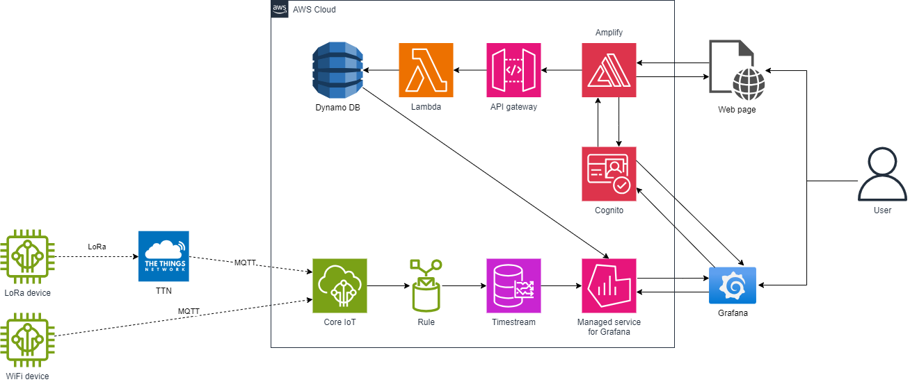

# MA_IoT - Hive Monitoring System
## Project Overview
This project, developed as part of the MA_IoT course at HES-SO, aims to create a smart monitoring system for beehives. The system uses sensors to track temperature, humidity, movement, and GPS position, transmitting data to the cloud for visualization and analysis. It supports both LoRaWAN and Wi-Fi communication, integrating AWS services for data storage and processing.

## Features
- Real-time monitoring of hive conditions (temperature, humidity, movement, door status).
- LoRaWAN or Wi-Fi communication for remote and local hives.
- Cloud storage & visualization using AWS IoT Core, Timestream, and Grafana.
- User authentication (using AWS Cognito) & device management (using Dynamo DB) via a web page hosted in Amplify.
- Remote control of hive door via MQTT (Wi-Fi version only).
- Scalable architecture to support up to 100,000 devices.

## System Architecture

## System Components
### Hardware
- Microcontrollers: ESP32 (Wi-Fi), Wio LoRaWAN GPS Tracker (LoRa).
- Sensors: Temperature & humidity (AHT20), accelerometer (LIS3DHTR), distance sensor (VL53L0X), GPS (simulated for Wi-Fi).
- Actuators: Servo motor for hive door control.

### Software & Cloud Services
- Communication: LoRaWAN (via The Things Network) & Wi-Fi (MQTT over AWS IoT Core).
- Data Storage: AWS Timestream for time-series data.
- User Management: AWS Cognito & DynamoDB for device-user linking.
- Visualization: Grafana dashboards with real-time alerts.
- Device Registration & API: AWS Lambda & API Gateway for managing devices.
 
